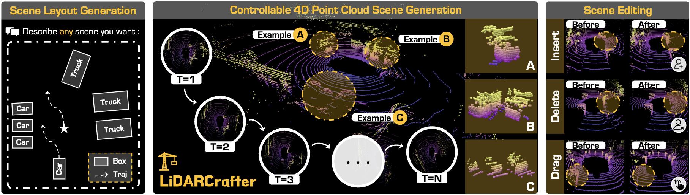
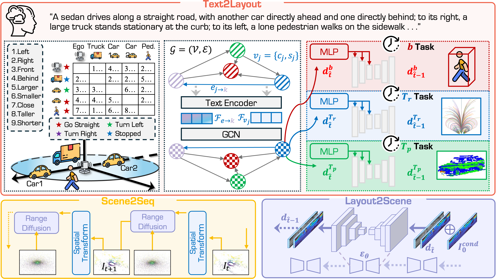
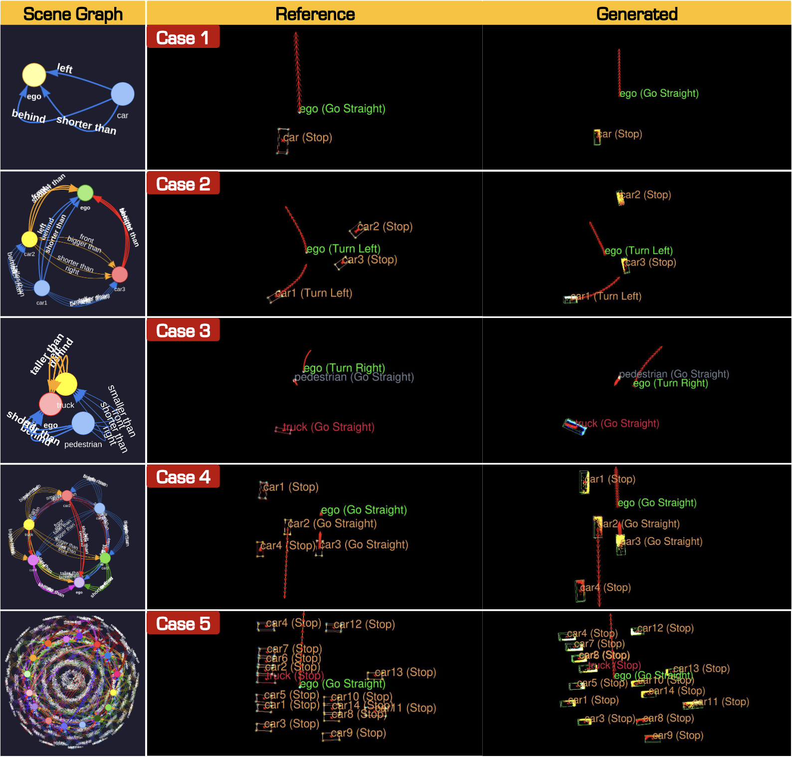

<p align="right">English | <a href="./README_CN.md">简体中文</a></p>  


<p align="center">
  

  <h1 align="center">
    <strong>LiDARCrafter: Dynamic 4D World Modeling from LiDAR Sequences</strong>
  </h1>

  <p align="center">
    <a href="https://alanliang.vercel.app/" target="_blank">Ao Liang</a>&nbsp;&nbsp;&nbsp;&nbsp;
    <a href="" target="_blank">Youquan Liu</a>&nbsp;&nbsp;&nbsp;&nbsp;
    <a href="https://yuyang-cloud.github.io/" target="_blank">Yu Yang</a>&nbsp;&nbsp;&nbsp;&nbsp;
    <a href="https://dylanorange.github.io/" target="_blank">Dongyue Lu</a>&nbsp;&nbsp;&nbsp;&nbsp;
    <a href="" target="_blank">Linfeng Li</a><br>
    <a href="https://ldkong.com/" target="_blank">Lingdong Kong</a>&nbsp;&nbsp;&nbsp;&nbsp;
    <a href="" target="_blank">Huaici Zhao</a>&nbsp;&nbsp;&nbsp;&nbsp;
    <a href="https://www.comp.nus.edu.sg/~ooiwt/" target="_blank">Wei Tsang Ooi</a>
  </p>

  <p align="center">
    <a href="https://arxiv.org/abs/2508.03692" target='_blank'>
      
    </a>&nbsp;
    <a href="https://lidarcrafter.github.io/" target='_blank'>
      
    </a>&nbsp;
    <a href="https://huggingface.co/datasets/Pi3DET/data" target='_blank'>
      
    </a>&nbsp;
    <a href="" target='_blank'>
      
    </a>
  </p>


 |
| :-: |


In this work, we introduce **LiDARCrafter**, a unified framework for 4D LiDAR generation and editing. We contribute:
- The first 4D generative world model dedicated to LiDAR data, with superior **controllability and spatiotemporal consistency**.
- We introduce a **tri-branch 4D layout conditioned pipeline** that turns language into an editable 4D layout and uses it to guide temporally stable LiDAR synthesis.
- We propose a **comprehensive evaluation suite** for LiDAR sequence generation, encompassing scene-level, object-level, and sequence-level metrics.
- We demonstrate **best single-frame and sequence-level LiDAR point cloud generation performance** on nuScenes, with improved foreground quality over existing methods.

:books: Citation
If you find this work helpful for your research, please kindly consider citing our paper:

```bibtex
@article{liang2025lidarcrafter,
    title   = {LiDARCrafter: Dynamic 4D World Modeling from LiDAR Sequences},
    author  = {Ao Liang and Youquan Liu and Yu Yang and Dongyue Lu and Linfeng Li and Lingdong Kong and Huaici Zhao and Wei Tsang Ooi},
    journal = {arXiv preprint arXiv:2508.03692},
    year    = {2025},
}
```


## Updates
- **[08/2025]** - The [technical report](https://arxiv.org/abs/2508.03692) of **LiDARCrafter** is available on arXiv.


## Outline
- [:gear: Installation](#gear-installation)
- [:hotsprings: Data Preparation](#hotsprings-data-preparation)
- [:rocket: Getting Started](#rocket-getting-started)
- [:wrench: Generation Framework](#wrench-generation-framework)
- [:snake: Model Zoo](#snake-model-zoo)
- [:memo: TODO List](#memo-todo-list)
- [License](#license)
- [Acknowledgements](#acknowledgements)


## :gear: Installation
For details related to installation and environment setups, kindly refer to [INSTALL.md](docs/INSTALL.md).


## :hotsprings: Data Preparation
Kindly refer to our **HuggingFace Dataset** :hugs: page from [here](https://huggingface.co/datasets/Pi3DET/data) for more details.


## :rocket: Getting Started
To learn more usage of this codebase, kindly refer to [GET_STARTED.md](docs/GET_STARTED.md).


## :wrench: Generation Framework

### Overall Framework
 |
| :-: |

### 4D Layout Generation
 |
| :-: |

### Single-Frame Generation
 |
| :-: |


## :snake: Model Zoo
To be updated.


## :memo: TODO List
- [x] Initial release. 🚀
- [ ] Release the training code.
- [ ] Release the inference code.
- [ ] Release the evaluation code.


## License
This work is under the <a rel="license" href="https://www.apache.org/licenses/LICENSE-2.0">Apache License Version 2.0</a>, while some specific implementations in this codebase might be with other licenses. Kindly refer to [LICENSE.md](docs/LICENSE.md) for a more careful check, if you are using our code for commercial matters.


## Acknowledgements
This work is developed based on the [MMDetection3D](https://github.com/open-mmlab/mmdetection3d) codebase.

> <br>
> MMDetection3D is an open-source toolbox based on PyTorch, towards the next-generation platform for general 3D perception. It is a part of the OpenMMLab project developed by MMLab.

Part of the benchmarked models are from the [OpenPCDet](https://github.com/open-mmlab/OpenPCDet) and [3DTrans](https://github.com/PJLab-ADG/3DTrans) projects.
